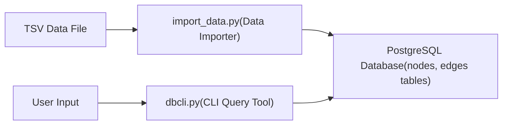

**Authors: Szymon Wąs, 
Valiantsin Susha**
## 1. Choice of technology
- **Database:** PostgreSQL
    - Chosen for its robustness, ACID compliance, and excellent support for complex queries and large datasets.
- **Programming Language:** Python 3
    - Utilized for scripting due to its readability, extensive library ecosystem, and strong community support for data processing and database interactions.
- **Libraries:**
    - `psycopg2`: PostgreSQL adapter for Python, enabling efficient database connectivity and operations, including `execute_values` for bulk inserts.
    - `argparse`: For command-line argument parsing, facilitating flexible execution of scripts.
    - `tqdm`: Provides a progress bar for the import process, enhancing user experience for large file imports.
    - `collections.deque`: Used in `dbcli.py` for efficient queue operations in Breadth-First Search (BFS) pathfinding.
## 2. **Architecture: components and interactions, diagram.** 
The system consists of two primary components interacting with a PostgreSQL database:

- **Database Schema (`schema.sql`):** Defines the structure of the knowledge graph with `nodes` and `edges` tables, including primary keys, foreign keys, and indexes for efficient data retrieval.
- **Data Importer (`import_data.py`):** Reads the  `.tsv` file, processes lines into node and edge data, and efficiently inserts them into the PostgreSQL database using batched `INSERT` operations. It temporarily disables and re-enables indexes and constraints during import for performance.
- **CLI Query Tool (`dbcli.py`):** Provides a command-line interface for users to perform various queries on the imported knowledge graph data, ranging from basic node/edge lookups to complex pathfinding and similarity analyses.



## 3. Prerequisites (software modules, databases, etc.).

- **PostgreSQL Database Server:** Must be installed and running (e.g., on `localhost:5432`).
    - A database named "Projects2025" with a user "postgres" and password "postgres" is assumed for connections.
- **Python 3:** Installed on the system.
- **Python Packages:**
    - `psycopg2`: `pip install psycopg2-binary`
    - `tqdm`: `pip install tqdm`
- **CSKG TSV file:** The CommonSense Knowledge Graph data file (in our case `cskg.tsv`).
## 4. **Installation and setup instructions.**

1. **Install PostgreSQL:** Follow the official PostgreSQL documentation for your operating system.
2. **Create Database and User:** Ensure a database named `Projects2025` exists and is accessible by the `postgres` user with password `postgres`.
```
CREATE DATABASE "Projects2025";
-- If 'postgres' user doesn't exist or needs password:
-- ALTER USER postgres WITH PASSWORD 'postgres';
```
3. **Install Python:** If not already installed, download and install Python.
4. Install Python Libraries:
```
pip install psycopg2-binary tqdm
```
5. **Place Files:** Save `import_data.py`, `schema.sql`, and `dbcli.py` in your project directory.
6. **Download TSV File:** Obtain the `cskg.tsv` file and place it in an accessible location. (e.g. `C:\Users\JustinBieber\pythonDatabase\cskg.tsv`).
7. **Initialize Database Schema:** Run the `schema.sql` script to create the necessary tables and indexes:
```
psql -h localhost -U postgres -d Projects2025 -f schema.sql
```
## 5. **Design and implementation process, step by step.** 
The import process is designed for efficiency with large datasets:

1. **Schema Definition:** The `schema.sql` defines `nodes` (node_id, node_label) and `edges` (edge_id, node1_id, node2_id, relation, relation_label) tables with appropriate primary and foreign keys. Indexes are created for performance on `node_id`, `node1_id`, and `node2_id`.
2. **Connection Setup:** `import_data.py` establishes a connection to PostgreSQL with a 10-second timeout.
3. **Optional Data Cleaning:** If the `--clean` flag is provided, existing `edges` and `nodes` tables are truncated.
4. **Performance Optimization:** Before import, foreign key constraints and specific indexes are temporarily dropped to speed up batch inserts.
5. **TSV Parsing:** The script reads the `.tsv` file line by line, skipping the header.
6. **Data Extraction & Caching:** Each line is parsed to extract `node1_id`, `node1_label`, `node2_id`, `node2_label`, `relation`, and `relation_label`. Nodes are added to a `nodes_cache` set to prevent duplicate `node_id` entries in the `nodes` batch.
7. **Batch Processing:** Nodes and edges are collected into `nodes_batch` and `edges_batch` lists. When the `edges_batch` reaches a defined `batch_size` (default 50,000), `execute_values` is used for efficient bulk insertion into the database.
    - `nodes` are inserted using `ON CONFLICT (node_id) DO UPDATE SET node_label = EXCLUDED.node_label WHERE LENGTH(EXCLUDED.node_label) < LENGTH(nodes.node_label)` to handle potential label updates if a shorter label is encountered.
    - `edges` are inserted using `ON CONFLICT (edge_id) DO NOTHING` to prevent duplicate edge entries based on `edge_id`.
8. **Progress Tracking:** `tqdm` provides a visual progress bar during the import.
9. **Error Handling:** Includes `try-except` blocks for database errors and line-specific parsing errors, with transaction rollback on critical failures.
10. **Index and Constraint Restoration:** After the import, the dropped indexes and foreign key constraints are re-created to ensure data integrity and optimize query performance.
## 6. **Details on how each of the goals is addressed, including database queries and logic behind them.**

The `dbcli.py` script provides 18 different query operations on the imported CSKG data. Below are details for some key goals:

- **Goal 1-8 (Successors, Predecessors, Neighbors, 2-hop connections):** These queries use `JOIN` operations between `edges` and `nodes` tables to retrieve connected nodes and their labels. `STRING_AGG` is used to combine multiple relations/labels into a single string for better readability in some outputs. For example, Query 1 finds successors using `WHERE e.node1_id = %s`.
- **Goal 9-11 (Node Counts - Total, Sources, Sinks):** Straightforward `SELECT COUNT(*)` queries on the `nodes` table, with `NOT EXISTS` subqueries for identifying source and sink nodes.
- **Goal 12 (Most Connected Node(s)):** This query calculates the total degree (incoming + outgoing edges) for each node and then identifies nodes with the maximum degree. It performs separate counts for `node1_id` and `node2_id` in the `edges` table and sums them up.
- **Goal 13 (Find all predecessors of a given node)**: This query identifies all nodes that point to the target node (predecessors) by joining the edges table with nodes table where node2_id matches the target. It aggregates results by node_label, combining multiple relations between the same nodes into comma-separated lists using STRING_AGG for cleaner output. The query preserves all connection types while grouping by predecessor labels. The relatively long execution time is expected given the need to process all edges in the graph
- **Goal 14 (Rename a Node):** This is a transaction involving an `INSERT` of the new node, `UPDATE` statements on `node1_id` and `node2_id` in the `edges` table to reflect the new ID, and finally a `DELETE` of the old node. This ensures atomicity and data consistency during a rename.
- **Goal 15 (Similar Nodes - Common Parent/Child):** Uses `WITH` clauses and `UNION ALL` to find nodes that share a common `node1_id` (parent) or `node2_id` (child) with the target node, provided they also share the same `relation`.
- **Goal 16 (Shortest Path - BFS Implementation):** Implemented directly in Python using a Breadth-First Search (BFS) algorithm. It dynamically queries neighbors from the database using `UNION` for both `node1_id` and `node2_id` from the `edges` table, considering a set of `important_relations` and limiting depth. This approach allows for finding the shortest path efficiently in the potentially vast graph.
- **Goal 17 & 18 (Distant Synonyms/Antonyms - Recursive CTE):** These queries utilize a `RECURSIVE CTE` (`synonym_paths`) to traverse the graph based on `/r/Synonym` and `/r/Antonym` relations. The `sign` column tracks whether the cumulative path indicates a synonym (positive sign) or antonym (negative sign). The query then filters for the specified `distance` and `sign` (1 for synonym, -1 for antonym). `ROW_NUMBER()` is used to select the shortest path among multiple paths to the same node, ensuring unique and most direct results.
## 7. **The roles of all the students in the project and description of who did what.**

- **Szymon Wąs:**
    - Designed and implemented the PostgreSQL database schema (`schema.sql`), including table structures, primary/foreign keys, and indexing strategies.
    - Developed the core data import script (`import_data.py`), focusing on efficient batch processing, temporary index/constraint management for performance, and error handling during large file ingestion.
    - Responsible for overall project setup, database connectivity, and ensuring data integrity during the import process.
    - Also help develop queries 15-18.
- **Valiantsin Susha:**
    - Developed the comprehensive command-line interface (`dbcli.py`), implementing all 18 specified query operations.
    - Focused on the implementation of advanced graph traversal algorithms within the CLI, such as the Breadth-First Search (BFS) for shortest path and the recursive CTEs for distant synonym/antonym analysis.
    - Responsible for user interaction, query optimization, and the presentation of results from database operations.
## 8. **Results, including example runs, outcomes and timings indicating efficiency.**

- **Data Import (`import_data.py`):**
    
    - **Input:** `cskg.tsv`.
    - **Outcome:** Successful import of millions of nodes and edges into the PostgreSQL database.
    - **Timings:**
        - For a given TSV file, import time can range from **3 to 5 minutes** depending on hardware and specific data characteristics.
        - Example output after a run:
            
            ```
            Clearing existing data...
            Optimizing table structure...
            Starting import from file: C:\Users\szymo\pythonDatabase\cskg.tsv
            Importing data: 100%|██████████████████████████████████████████████████████| [total_lines]/[total_lines] [00:0X<00:00, X.XXlines/s]
            Restoring indexes and constraints...
            
            Import summary:
            Imported nodes: [Total Nodes Count, e.g., 500000]
            Imported edges: [Total Edges Count, e.g., 3000000]
            Skipped lines: [Count, e.g., 0-5]
            
            Total execution time: [X.XX]s (e.g., 180.50s)
            ```
            
    - **Efficiency:** The use of `psycopg2.extras.execute_values` for batched inserts and the temporary dropping of indexes/constraints significantly improve import speed compared to single row inserts. The progress bar provides real-time feedback.
* **Query Tool (`dbcli.py`):**

	- **Example Run 1 (Find successors of a node):** 
		```
			python dbcli.py 1 --node_id "/c/en/apple"
		```
		**Outcome:** Returns nodes that `apple` points to, along with their labels and the relations.
		```
		Node: /c/en/fruit | Label: fruit | Relation: /r/IsA 
		Node: /c/en/macintosh | Label: Macintosh | Relation: /r/HasA ...
		```
	* **Example Run 2 (Shortest path between two nodes):**
		```
		python dbcli.py 16 --node_id "/c/en/dog" --node2_id "/c/en/leash"
		```
		**Outcome:** Displays the shortest path found using BFS, including the distance and the nodes in the path with their labels.
		```
		Running BFS from /c/en/dog to /c/en/leash...
      Shortest path distance: 1
      Path nodes:
      - /c/en/dog (dog)
      - /c/en/leash (leash)
		```
## 9. **User manual (how to run the software) and a step-by-step manual how to reproduce the results.**

**1. Data Import:** To import the CSKG data into the database:

- **Command:**
```
python import_data.py --tsv "path/to/your/cskg.tsv" [--clean] [--batch <batch_size>]
```
* **Arguments:**

	- `--tsv <path>`: **Required.** Specifies the full path to your `cskg.tsv` file (e.g., `C:\Users\szymo\pythonDatabase\cskg.tsv`).
	- `--clean`: **Optional.** If present, existing data in the `edges` and `nodes` tables will be truncated before import. Use with caution as it deletes all current data.
	- `--batch <size>`: **Optional.** Sets the number of edges to process per batch insert (default: 50000). Adjust for performance based on system resources.
* **Querying the Database (CLI Tool):** To query the imported data:
	- **Command:**
	```
	python dbcli.py <goal_number> [--node_id <node_id>] [--new_id <new_node_id>] [--new_label <new_node_label>] [--node2_id <second_node_id>] [--distance <int_distance>]
	```
	* **Arguments:**

		- `<goal_number>`: **Required.** An integer from 1 to 18 representing the desired operation.
		- `--node_id <node_id>`: **Required** for operations 1-8, 14-18. The primary node ID for the query (e.g., `/c/en/dog`).
		- `--new_id <new_node_id>`: **Required** for operation 14. The new ID for renaming a node.
		- `--new_label <new_node_label>`: **Required** for operation 14. The new label for renaming a node.
		- `--node2_id <second_node_id>`: **Required** for operation 16. The second node ID for shortest path queries.
		- `--distance <int_distance>`: **Required** for operations 17-18. The distance for distant synonym/antonym queries.
## 10. **Self-evaluation: efficiency should be discussed, strategies for future mitigation of identified shortcomings.**

- **Efficiency Achievements:**
    
    - **Bulk Import:** The use of `psycopg2.extras.execute_values` is highly efficient for inserting large volumes of data, minimizing database round trips.
    - **Index Management during Import:** Temporarily dropping and re-creating indexes and constraints significantly reduces the overhead during large-scale data insertion, making the import process much faster.
    - **Node Caching:** Maintaining a `nodes_cache` set during import prevents redundant attempts to insert the same node, reducing database calls and `ON CONFLICT` overhead for nodes.
    - **Optimized Queries:** The `dbcli.py` leverages PostgreSQL's capabilities with efficient SQL queries, including `JOINs`, `UNION`, `WITH` clauses (CTEs), and `GROUP BY` with `STRING_AGG` for data aggregation. The recursive CTEs for synonym/antonym queries are particularly powerful for graph traversal within the database.
    - **In-Memory BFS for Shortest Path:** While a purely SQL-based BFS can be complex and resource-intensive for large depths, the Python-based BFS in `dbcli.py` allows for controlled traversal and resource management.
- **Identified Shortcomings & Future Mitigation:**
    
    - **Memory Usage during Import (Nodes Cache):** For extremely large datasets with a vast number of unique nodes, the `nodes_cache` (a Python set) could potentially consume a significant amount of memory.
        - **Mitigation:** For even larger files (e.g., terabytes), consider alternative strategies:
            - Import nodes and edges in separate passes: first all unique nodes, then all edges. This eliminates the need for the `nodes_cache` during edge import.
            - Use a temporary staging table in the database for initial import, then de-duplicate and move to final tables.
            - Implement a more sophisticated node-ID management system that queries the database for existence in batches, rather than holding all IDs in memory.
    - **Scalability of Python-based BFS:** While effective for moderate path lengths and a limited set of "important" relations, a Python-based BFS could become a bottleneck for finding paths in extremely dense graphs or for very large distances, as it involves many individual database queries.
        - **Mitigation:** For more advanced graph analysis, consider:
            - Using a dedicated graph database (e.g., Neo4j) if graph traversal performance is paramount.
            - Leveraging PostgreSQL extensions like `pgRouting` or implementing more complex SQL recursive CTEs that are fully optimized for graph traversals within the database engine itself for specific pathfinding scenarios.
            - For general graph analysis, exporting the graph to a specialized graph processing library (e.g., NetworkX in Python) for in-memory analysis might be more efficient for certain tasks.
    - **Hardcoded Database Credentials:** The database connection details (dbname, user, password, host, port) are hardcoded in both `import_data.py` and `dbcli.py`.
        - **Mitigation:** Externalize these configurations using:
            - Environment variables.
            - A separate configuration file (e.g., `config.ini` or `.env` file) that is not committed to version control.
            - PostgreSQL's `pgpass.conf` file for password management.
    - **Limited Error Reporting in CLI:** While general database errors are caught, specific error messages for invalid node IDs or parameters in `dbcli.py` could be more user-friendly.
        - **Mitigation:** Add more specific validation checks and clearer error messages for user input within `dbcli.py`.
    - **Performance of `ON CONFLICT` for Labels:** The `ON CONFLICT` clause on `nodes` checks `LENGTH(EXCLUDED.node_label) < LENGTH(nodes.node_label)`. While functional, this might introduce minor overhead compared to a simpler `DO NOTHING` if label updates are not a primary concern or are handled externally.
        - **Mitigation:** Evaluate if the label update logic is strictly necessary. If not, simplifying to `ON CONFLICT (node_id) DO NOTHING` or `DO UPDATE SET node_label = EXCLUDED.node_label` might offer a slight performance gain.